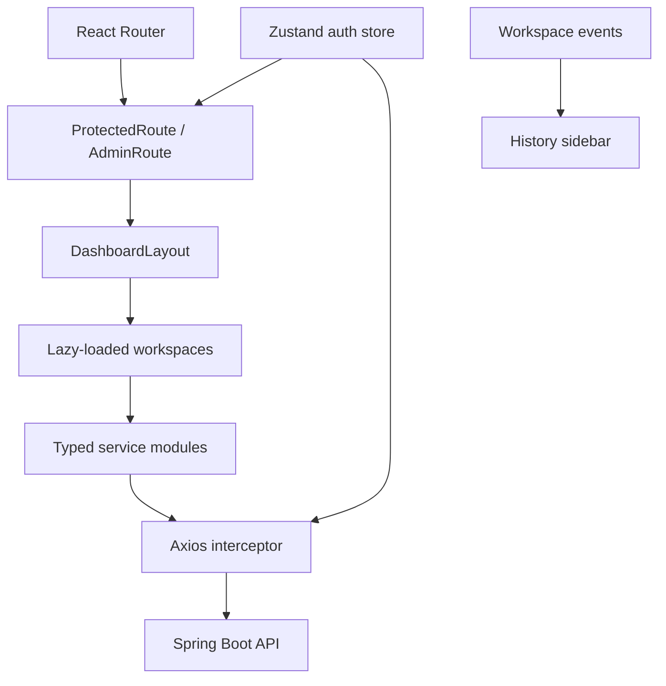
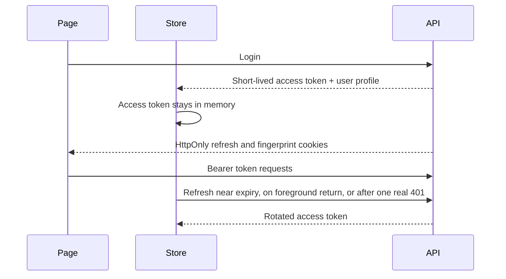
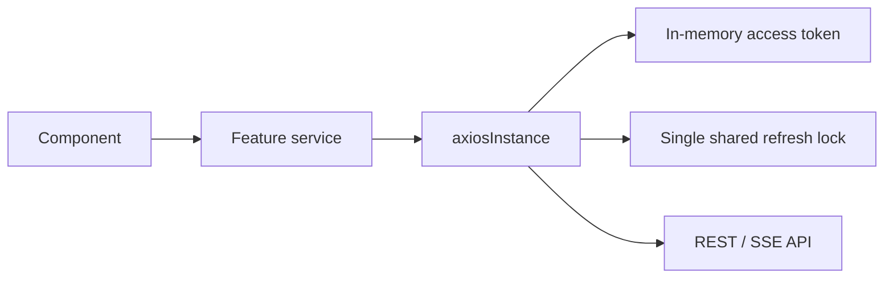

# CareerForge AI Frontend

React and Vite client for the CareerForge AI career workspace.


## Product Surfaces

- Welcome workspace chooser after user login
- Career chat with streaming Markdown and HTML artifacts
- Resume analysis, ATS coaching, job matching, generation, and PDF download
- Human-style live interview room and written interview practice
- Cover letters, live jobs, image generation, wallet, payments, support, profile, and settings
- Separate admin console for users, plans, promotions, support, traffic, latency, and runtime health

## Frontend Architecture



## Authentication In The Browser



Only non-sensitive display profile data is cached in local storage. Access tokens are held in memory; refresh credentials are not readable by JavaScript.

## Login Destination

Normal users now open `/welcome` after password or OAuth login. The page is a functional workspace chooser, not a marketing landing page. Admin users continue to open `/admin/dashboard`.


## Interview Experience

The interview setup supports:

- Job interview, campus placement, college admission, career switch, and general practice goals
- Student, early-career, mid-career, and senior candidates
- Any profession or course, not only software roles
- Optional company or college context
- Optional job description or preparation notes
- Existing analyzed resume selection
- Direct PDF/DOCX upload and analysis from the interview setup
- Hindi, Hinglish, English, automatic language matching, and strict interviewer mode

The live room uses a real-person image tile with transform-only speaking motion. Candidate audio/video is sent directly from the browser to Gemini Live using an ephemeral token. The Spring Boot server does not proxy media frames, which keeps server CPU and bandwidth lower.

Performance controls:

- Interview, resume, jobs, support, and admin pages are lazy-loaded.
- Audio transcription updates are batched before React state updates.
- Video frames are compressed and sampled rather than streamed at camera frame rate.
- Conversation and resume streams buffer small deltas before rerendering Markdown.
- Search boxes use delayed requests instead of calling the backend for every keystroke.
- The session refresh loop pauses when the tab is inactive and uses backoff when the backend is unreachable.

## Responsive Layout

- Desktop uses a collapsible history sidebar and fixed top bar.
- Mobile uses a drawer sidebar and a compact top bar.
- Interview camera becomes picture-in-picture on mobile.
- Composer controls account for safe-area insets and the visual viewport.
- Fixed workspaces use `minmax(0, 1fr)` and bounded dimensions to avoid horizontal overflow.

## API Service Boundary

Pages do not construct backend URLs directly. Calls are grouped under `src/services`, while endpoint paths live in `src/config/api`.



For SSE features, the client performs one authorized fetch, parses named events, batches chunks, and retries authorization once after a genuine 401.

## Screen Gallery

<table>
  <tr>
    <td width="50%"></td>
    <td width="50%"></td>
  </tr>
  <tr>
    <td align="center">Public product entry</td>
    <td align="center">User authentication</td>
  </tr>
  <tr>
    <td width="50%"></td>
    <td width="50%">Authenticated welcome and interview captures should be recorded against a running local backend so no fake session or secret appears in repository media.</td>
  </tr>
</table>

## Local Development

Create `.env` from `.env.example`:

```env
VITE_API_BASE_URL=http://localhost:9092
```

Run:

```powershell
npm install
npm run dev
```

Production build:

```powershell
npm run build
```

Focused lint example:

```powershell
npx eslint src/pages/Interview src/pages/Welcome src/routes/AppRoutes.jsx
```

## Deployment

- `VITE_API_BASE_URL` must be the backend origin, without a frontend route suffix.
- Configure backend CORS with the exact deployed frontend origin.
- Serve the frontend over HTTPS before enabling production cookies, microphone, camera, OAuth, or payment flows.
- OAuth callback URLs point to the backend; OAuth success redirects point to the frontend.
- Never put provider secrets, JWT secrets, database credentials, Razorpay secrets, or Gemini keys in `VITE_*` variables.

## Media And Documentation Safety

Before committing screenshots or videos:

1. Use a demo account with fake data.
2. Hide email addresses, IP addresses, access tokens, payment IDs, API keys, and browser extension panels.
3. Do not record `.env`, terminal history, cloud consoles, database consoles, or network request headers.
4. Record authenticated flows against localhost or a dedicated staging environment.
5. Review every frame before publishing.

A real walkthrough video is intentionally not fabricated from static screens. Record it only when the backend, demo account, and provider integrations are available together.