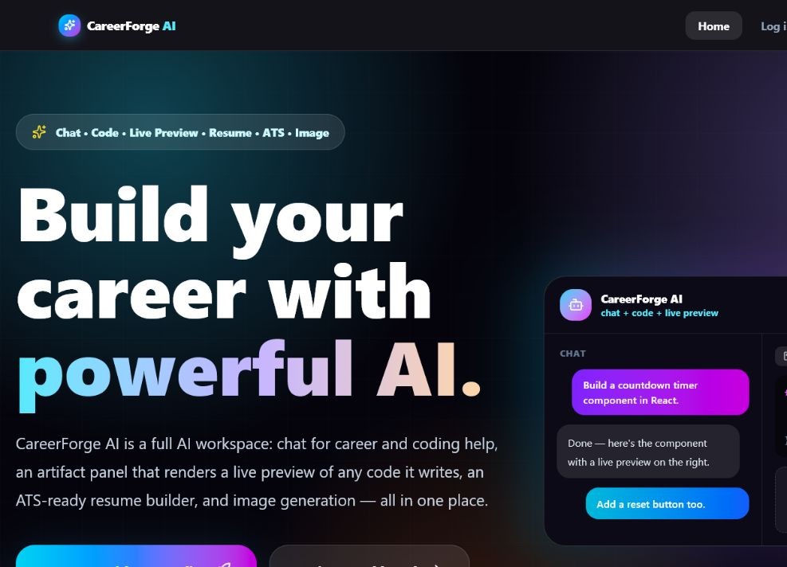
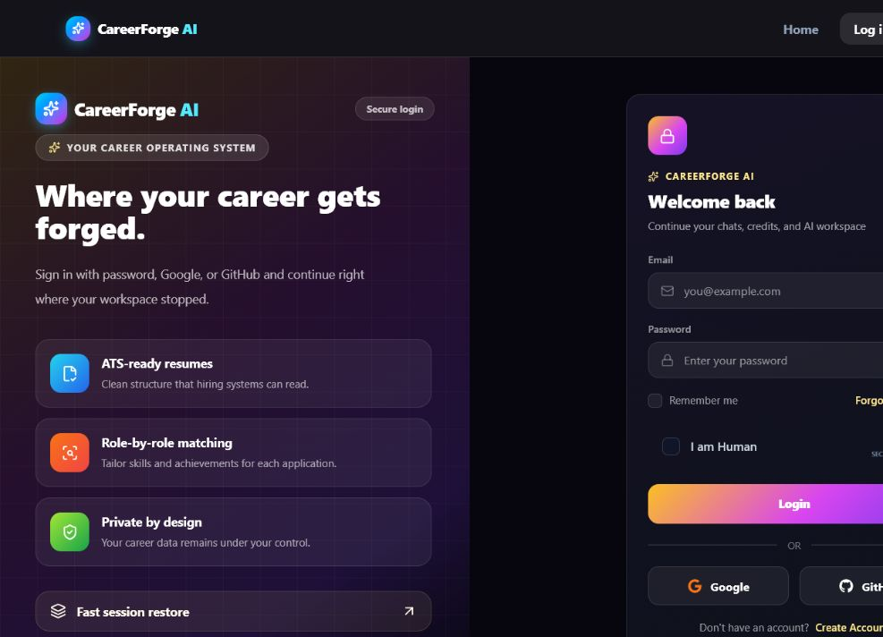
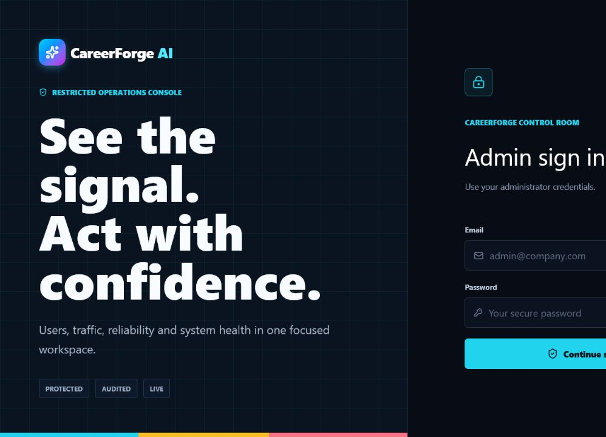
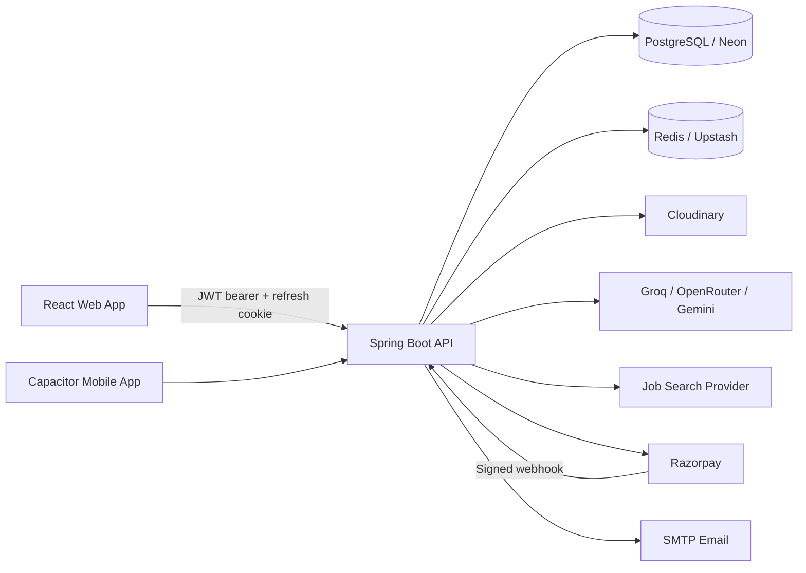

# CareerForge AI

<p align="center">
  <strong>AI Career Operating System for resumes, career conversations, live jobs, applications and employability.</strong>
</p>

<p align="center">
  
  
  
  
  
</p>



## Product

CareerForge AI combines career chat, resume analysis and generation, ATS guidance, live jobs, image generation, payments, support and operations monitoring in one responsive application. The AI model is a component; the product is the complete career workflow around it.

| Surface | Local URL | Production / callback URL |
|---|---|---|
| Web app | `http://localhost:5173` | Set with your frontend deployment domain |
| REST API | `http://localhost:9092` | `http://careerforge-ai-env.eba-mp5s8gpr.ap-south-1.elasticbeanstalk.com` |
| Admin console | `http://localhost:5173/admin/login` | `{FRONTEND_URL}/admin/login` |
| API health | `http://localhost:9092/actuator/health` | `{BACKEND_URL}/actuator/health` |
| Google callback | - | `{BACKEND_URL}/login/oauth2/code/google` |
| GitHub callback | - | `{BACKEND_URL}/login/oauth2/code/github` |
| Razorpay webhook | - | `{BACKEND_URL}/api/payment/webhook` |

`FRONTEND_URL` is the browser app origin. OAuth callbacks and Razorpay webhooks always use the backend origin.

## Phase 1

### Delivered

- Email registration, verification, password login and password reset
- Google and GitHub OAuth2 login
- JWT access tokens in memory and rotating HttpOnly refresh cookies
- Fingerprint-bound sessions and logout across devices
- Role-safe admin OTP login and refresh-token restoration
- Career-focused streaming chat with Markdown, artifacts and conversation history
- Resume PDF/DOCX parsing, ATS analysis, job matching, resume chat and PDF generation
- Configurable Gemini resume models from YAML/environment variables
- Editable Cover Letter Studio with multiple styles, history, wallet charging, and PDF/DOCX export
- Live job search with filters and apply links
- AI image generation, history, favorites, regenerate and download
- Wallet, plans, promo campaigns and Razorpay payment history
- Idempotent payment settlement plus automatic post-downtime reconciliation
- User support tickets and admin support inbox
- Admin users, plans, promotions, traffic, latency, JVM and request monitoring
- Responsive desktop/mobile layouts and friendly handled-error states

### Phase 1 gaps carried to the next delivery

- Visual drag-and-drop resume builder and multiple editable ATS templates
- DOCX resume export
- Cover-letter workspace
- Saved jobs, alerts and application tracking
- Interview, voice interview and career roadmap workspaces
- Persistent analytics warehouse, Prometheus/Grafana and feature-toggle enforcement
- Production MCP server and OAuth scope model

The detailed acceptance checklist is in [docs/PHASE-1.md](docs/PHASE-1.md).

## Core Screens

<table>
  <tr>
    <td width="50%"></td>
    <td width="50%"></td>
  </tr>
  <tr>
    <td align="center"><strong>User authentication</strong></td>
    <td align="center"><strong>Restricted admin access</strong></td>
  </tr>
</table>

## Architecture



### Security model

- Access tokens are short-lived and held only in frontend memory.
- Refresh token and fingerprint are HttpOnly cookies.
- Refresh rotation preserves the original role and admin absolute-session deadline.
- `/api/admin/**` requires `ROLE_ADMIN`; user surfaces accept only their configured roles.
- Payment webhooks are public only at the transport layer and require Razorpay HMAC verification.
- Sensitive keys belong in `.env` or deployment secrets, never in Git.

## Repository Layout

```text
TrackAI project/
|-- job tracker backend/   Spring Boot API
|-- trackai-frontend/      React + Vite web application
|-- careerforge-mobile/    Capacitor mobile application
|-- docs/                  Product and delivery documentation
`-- README.md
```

## Run Locally

### Backend

Requirements: JDK 21, Maven Wrapper, PostgreSQL and Redis credentials.

```powershell
cd "job tracker backend"
.\mvnw.cmd spring-boot:run
```

Backend configuration lives in `src/main/resources/application-common.yml`; secret values are injected through `.env`.

### Frontend

Requirements: Node.js and npm.

```powershell
cd trackai-frontend
npm install
npm run dev
```

Create `trackai-frontend/.env`:

```env
VITE_API_BASE_URL=http://localhost:9092
```

## Required Authentication Variables

```env
JWT_SECRET=base64_encoded_secret_at_least_256_bits
GOOGLE_CLIENT_ID=your_google_client_id
GOOGLE_CLIENT_SECRET=your_google_client_secret
GITHUB_CLIENT_ID=your_github_oauth_client_id
GITHUB_CLIENT_SECRET=your_github_oauth_client_secret
FRONTEND_URL=http://localhost:5173
BACKEND_URL=http://localhost:9092
GEMINI_API_KEY=your_gemini_key
TOKEN_COST_COVER_LETTER=25
COVER_LETTER_RATE_CAPACITY=6
COVER_LETTER_RATE_REFILL_TOKENS=6
COVER_LETTER_RATE_REFILL_MINUTES=1
```

A GitHub App RSA private key is not required for the current OAuth login flow. Use a GitHub OAuth App client ID and client secret.

## API Areas

| Area | Base path |
|---|---|
| Authentication | `/api/auth` |
| Users | `/api/users` |
| Conversations | `/api/conversations` |
| Career chat | `/api/chat` |
| Resume AI | `/api/resumes` |
| Cover letters | `/api/cover-letters` |
| Live jobs | `/api/jobs` |
| Images | `/api/images` |
| Wallet | `/api/wallet` |
| Payments | `/api/payment` |
| Plans and promos | `/api/plans`, `/api/promos` |
| Support | `/api/support/tickets` |
| Admin | `/api/admin` |

## MCP Direction

MCP will be introduced as a separately secured integration boundary, not as an unauthenticated shortcut to internal services. Planned tools include resume summaries, ATS gap analysis, job search and career workspace context. Before enabling it in production, the backend must move from Spring Boot 3.3 to a Spring AI-compatible supported line, add scoped OAuth authorization and enforce per-tool rate limits and wallet charging. See [docs/MCP.md](docs/MCP.md).

## Verification

```powershell
# backend
.\mvnw.cmd test

# frontend
npm run lint
npm run build
```

## Deployment Notes

- Keep the API, PostgreSQL and Redis in the same region to avoid a network round trip on every uncached operation.
- Put HTTPS in front of the frontend and backend before production OAuth/payment launch.
- Configure `FRONTEND_URL`, `BACKEND_URL`, CORS origins and provider callback URLs together.
- Restart the backend after schema/config changes; sign in again when token-claim structure changes.

## License

Private project. All rights reserved.